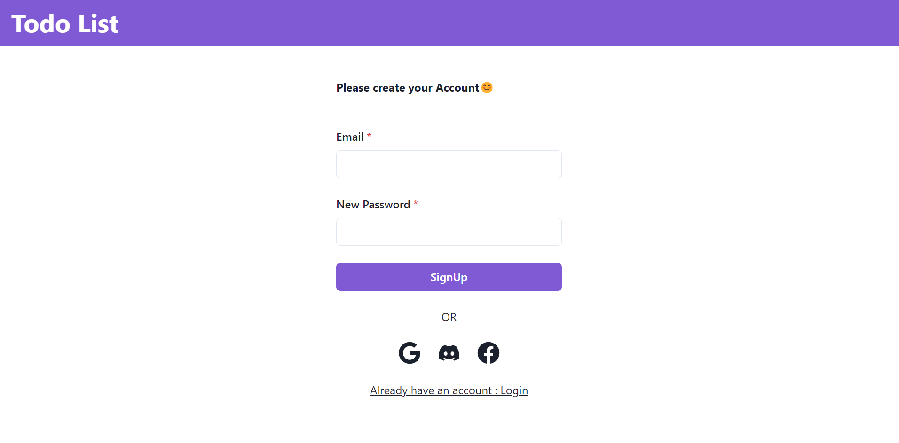
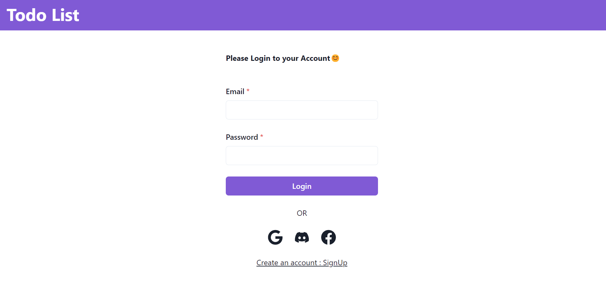
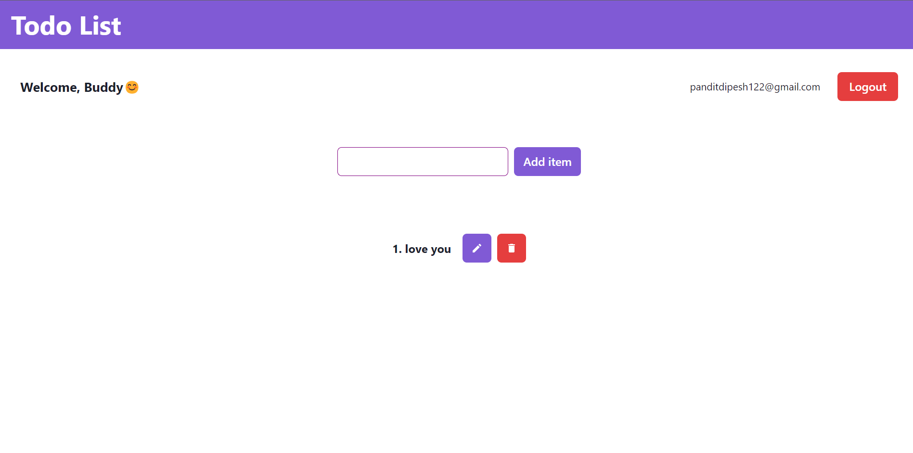
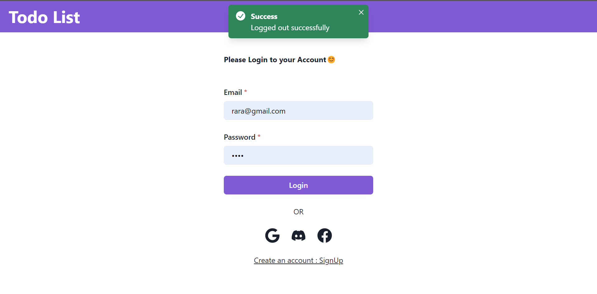

This is my first MERN Project. I have named this a "TODO LIST" where we can sign up, log in, and perform CRUD operations. All the operations will be saved to the database automatically. I have also included third-party authentication with Facebook, Google, and Discord where their session data will be stored for 1 hour.

-------------------------------------------------------

Frontend: React.js with Chakra UI
Backend:Express.js
Database: MongoDB

-------------------------------------------------------
Demo:

