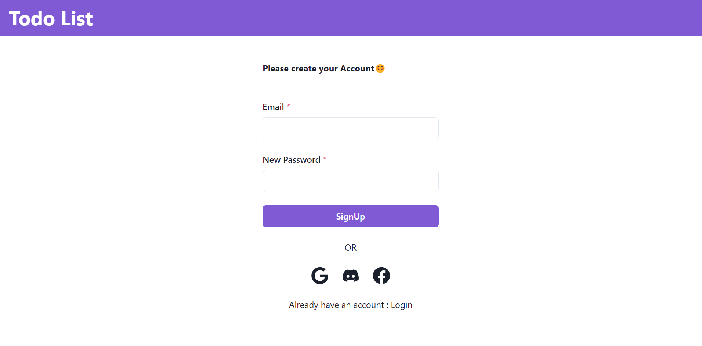
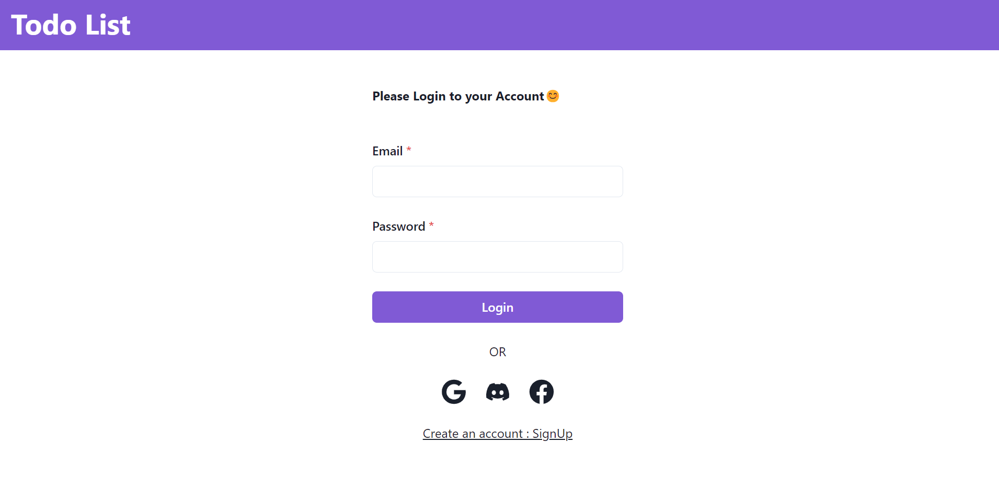
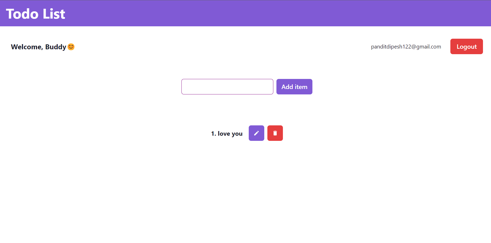
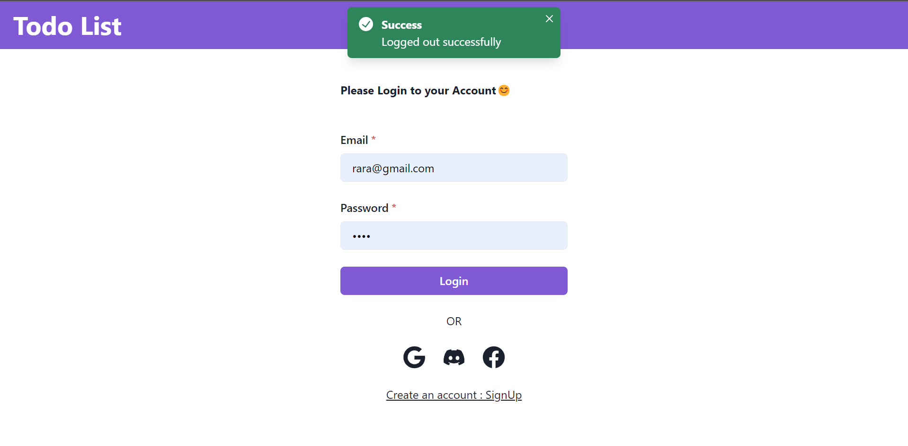

This is my first MERN Project. I have named this as TODO APP which includes everthing from data inserting to database to CRUD operation and Third party login authentication. All the web app is fully responsive.

-------------------------------------------------------

Frontend: React.js with Chakra UI
Backend :Express.js
Database: MongoDB

-------------------------------------------------------

